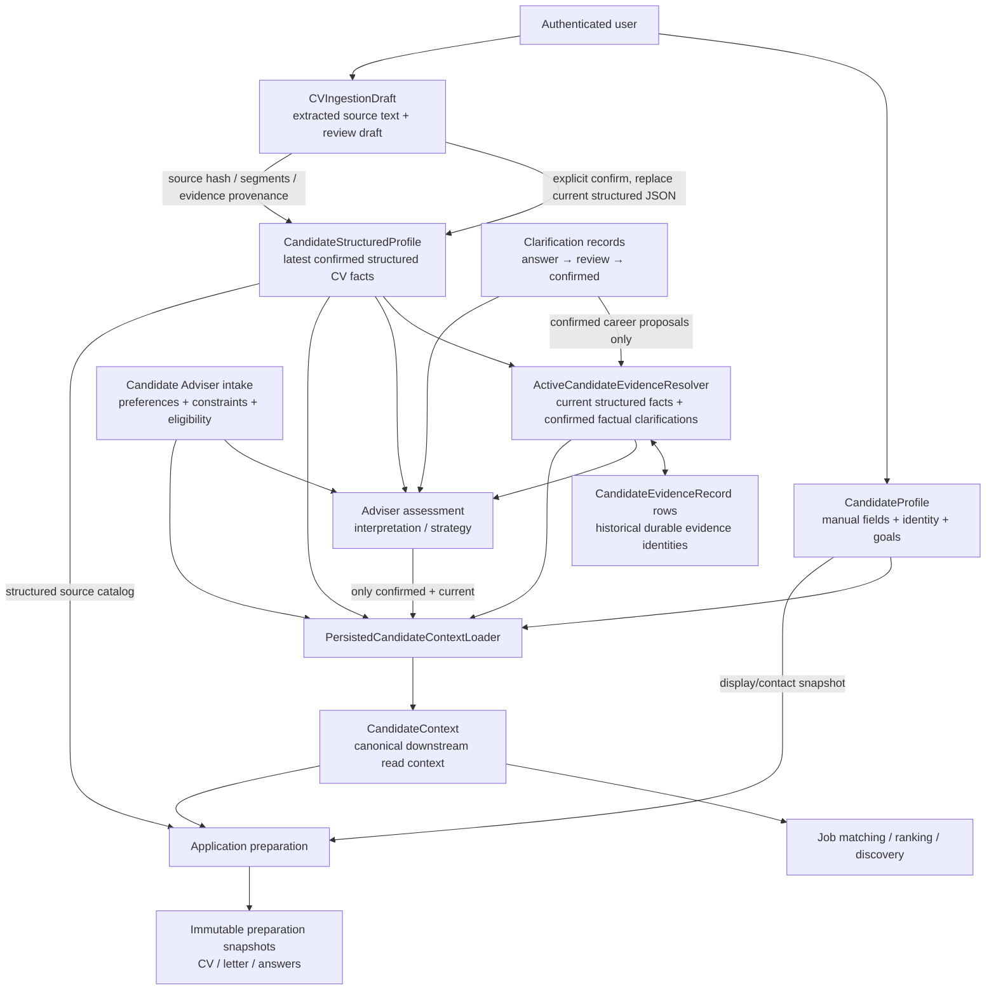

# Canonical Candidate Profile Audit

**Issue:** [#203 — Canonical Candidate Profile A](https://github.com/RayZhang2024/Career-trans/issues/203)
**Parent:** [#202 — Canonical Candidate Profile](https://github.com/RayZhang2024/Career-trans/issues/202)
**Audit branch:** `codex/issue-203-canonical-candidate-audit`
**Frozen audit baseline:** `e8b174479a2c36b734ce6dd6f82fef155c578ba8` (`main` at audit start)
**Audit scope:** repository code, schemas, migrations, existing tests, and committed synthetic/demo material only. No live provider calls or private user data were used.

**Historical note:** this audit records the repository at its frozen Issue #203 audit baseline, before Issue #207. Its point-in-time descriptions of Profile writes and CV-only structured authority have since been superseded by the manual revision workflow documented in `docs/ARCHITECTURE.md`.

## Executive summary

Career-trans already has several separate user-owned candidate domains. The closest current authority for structured career facts is `CandidateStructuredProfile`, written only by the CV confirmation workflow. `ActiveCandidateEvidenceResolver` is the current authority for the active factual `CareerEvidence` set: it derives current claims from the structured profile plus confirmed factual Adviser clarifications, and reconciles them with durable evidence rows. These are related authorities, not duplicate representations of one model.

The current composition machinery is centred on `PersistedCandidateContextLoader`, which produces the matching-oriented `CandidateContext` projection from structured facts, active evidence, manually edited profile fields, Adviser intake/preferences/eligibility, and only a current confirmed Adviser assessment. This is the right architectural direction: **multiple intentionally separate authoritative domains composed behind one canonical confirmed read boundary**, not one new persisted candidate model. However, `CandidateContext` is deliberately lossy: it contains flattened profile/skills/strategy text, eligibility, and active evidence rather than the typed employment, education, projects, achievements, credentials, identity, and source/status information needed by the Profile UI. The target should therefore be a richer read-only candidate snapshot that can project `CandidateContext` for matching rather than treating `CandidateContext` itself as the universal Profile read model. The existing loader is also not yet a safe uniform read boundary: its normal path reconciles evidence and commits, `summary()` does the same, some Adviser GET paths materialize/commit clarifications, and application preparation independently loads the structured CV again.

The Profile UI/API is not the current structured confirmed profile view. It reads and immediately edits `CandidateProfile` scalar fields. Confirmed CV facts are persisted elsewhere and are not displayed there. CV uploads store extracted source text, hashes, segments, draft extraction/review data, and confirmation state; the original uploaded file bytes are not retained by the inspected persistence path. Confirming a review-ready CV replaces the user's entire `CandidateStructuredProfile.structured_json`, then reconciles active evidence. Older draft/source records and evidence rows remain persisted; active evidence is determined by matching current claims, not by an active flag.

Adviser interpretation remains a separate strategy domain. Intake writes immediately and feeds career context (including eligibility); assessment output affects context only when confirmed and current. A confirmed factual clarification does not update `CandidateStructuredProfile` or `CandidateProfile`; it becomes additional active factual evidence through the resolver. Unconfirmed clarification answers/proposals are excluded from downstream context.

Candidate/evaluation fingerprints already make current opportunity authority candidate-specific. The normal context projection influences matching, relevance, and career alignment; changes create a different fingerprint, so old evaluations remain historical and cease to be current. Adviser staleness is a separate semantic-input fingerprint. Application preparations are immutable snapshots and are not retroactively invalidated; new preparations include candidate facts, evidence sources, target, options, and application identity in their input fingerprint.

**Schema decision: no schema change is established as necessary by this audit.** First make the existing composition boundary explicit and read-only, route consumers through it, then separately address Profile display/edit semantics, CV replacement/conflict review, and Adviser proposal UX. Avoid a new candidate table until a concrete unsupported invariant is demonstrated.

## Audit method and limits

Evidence was prioritised in this order: current production implementation and schemas; migrations/persistence definitions; existing deterministic tests; current docs; historical issue descriptions. Relevant code references use repository-relative paths and line numbers from the frozen baseline. The audited implementation includes the exact symbols named below; line numbers are aids and should be refreshed if later commits move code.

The audit did not inspect the untracked local files present at start, any production database, or real uploaded CVs. Tests run use the repository's deterministic test fixtures and fake semantic components. Where the repository cannot prove a runtime or legacy-data fact, it is listed under uncertainties.

## Current-state architecture



The arrow from the resolver to evidence storage is conditional: `resolve()` creates/updates records and returns the current set; `read_active()` only selects existing records for the derived current claims. `CandidateEvidenceRecord` has no active flag. The loader is a composition point, but not every consumer uses only its returned context: application preparation also reads `CandidateStructuredProfile` directly to build the bounded application source catalog.

## Candidate-domain authority map

| Domain | Current authority / persistence | Confirmation and provenance | Downstream use | Intentionally separate? |
|---|---|---|---|---|
| Account identity | `User` (`users`); email is fallback application email. `CandidateProfile` contains display name and preferred email/contact fields. | Account identity is authenticated; profile metadata is immediately saved by create/PATCH. Not part of CV confirmation. | Application identity snapshot; authenticated ownership. | Yes. Keep display/contact metadata distinct from career facts. |
| Manual profile fields | `CandidateProfile` / `candidate_profiles`: headline, summary, current role, location, career goal, job criteria, identity/contact URLs (`models/candidate_profile.py:10-39`). | `POST`/`PATCH /profile` commits immediately (`api/routes/profile.py:29-59`, `services/profile_service.py:8-35`). No draft/confirm revision. No per-field provenance. | Loader projects headline/current role/summary/location, career goal, job criteria (`cv_ingestion_service.py:320-345`); application preparation requires display name and snapshots identity. | Yes as a separate editable profile/preferences/identity store today; manual fields can nevertheless affect active downstream context immediately. |
| Structured factual career profile | `CandidateStructuredProfile` / `candidate_structured_profiles`, one row per user, JSON `CandidateCVData` (`models/candidate_cv_ingestion.py:46-53`; schema `schemas/cv_ingestion.py:108-117`). | Created/replaced only by `CVIngestionService.confirm`; draft state must be `review_ready`. Structured sections have no source-level provenance in the schema. | Profile-context composition; active evidence builder; Adviser semantic input; application source catalog. | Yes. It is the current structured CV-fact authority, not the full candidate context. |
| CV source and draft | `CandidateCVIngestionDraft` / `candidate_cv_ingestion_drafts`; extracted docs, source hash, segment text/IDs, parsed/semantic merged JSON, draft state. `CandidateCVReviewBaseline` stores immutable interpreted-evidence baseline (`models/candidate_cv_ingestion.py:10-44`). | States `uploaded → review_ready → confirmed`. Upload persists extracted text/hash/segments, not original binary; interpretation/review save draft only. CV evidence edits can retain/remove unchanged extracted evidence, not rewrite its text/provenance (`cv_ingestion_service.py:46-120`). | Source/review UI and confirmation only. Unconfirmed drafts do not enter the loader. | Yes. Source, extracted draft, and confirmed structured state remain separately addressable. |
| Active factual evidence | Durable rows `CandidateEvidenceRecord` / `candidate_evidence`, unique `(user_id,fingerprint)` (`models/candidate_cv_ingestion.py:55-68`). Runtime view is `CareerEvidence`. | Authority belongs to `ActiveCandidateEvidenceResolver`; current claims are rebuilt from confirmed structured facts plus confirmed factual/mixed clarifications. CV provenance keeps document SHA/segment IDs; profile-derived employment/education/credentials use generated `confirmed_profile` refs; clarification evidence uses `clarification:<id>` (`active_candidate_evidence.py:50-63,178-274`). | Requirement matching, evidence retrieval, Adviser, fingerprints, and application source catalog. | Yes. This is canonical factual evidence for evidence-based matching, distinct from the structured record. |
| Eligibility | `CandidateEligibility` schema embedded in the Adviser intake JSON; there is no separate eligibility ORM model/table (`schemas/candidate.py:53-58`, `models/candidate_adviser.py:10-18`). | Saved with intake by `save_intake`, immediately; no separate confirmation workflow. A clarification classified as eligibility does not become CareerEvidence. | Loader maps intake eligibility directly to `CandidateContext`; factual requirement evaluation/career profile uses it. | Yes. Keep eligibility typed and separately sourced from semantic career evidence. |
| Goals, preferences, constraints | `CandidateProfile.career_goal/job_search_criteria` and `CandidateAdviserIntakeRecord` (`CandidateAdviserIntake` fields include direction, preferences, constraints, tradeoffs, motivations). | Profile PATCH and Adviser intake PUT save immediately. Assessment confirmation is not a confirmation boundary for those inputs. | Context loader combines profile and intake fields; career alignment and search/relevance projections consume them. | Yes. These are user-authored preference inputs, not CareerEvidence. |
| Adviser interpretation / strategy | `CandidateAdviserAssessmentRecord` JSON plus `input_fingerprint` and stored status; user-scoped single row (`models/candidate_adviser.py:20-33`). | Generated assessment is `review_ready`; explicit confirm sets `confirmed`. Effective status is `stale` when current semantic-input fingerprint differs. Context includes only confirmed/current assessment (`candidate_adviser_service.py:60-110,191-206`; loader lines 323-338). | Strategy summaries/role hypotheses/job-search strategy in context; not factual evidence. | Yes. Keep interpretation separate from factual truth. |
| Adviser clarification | `CandidateAdviserClarificationRecord`, retaining question, answer, interpretation, origin assessment fingerprint, state, confirmation timestamp (`models/candidate_adviser.py:35-54`). | Answer is interpreted into review-ready proposal; explicit confirm is atomic with evidence reconciliation (`candidate_adviser_service.py:151-189`). Confirmed career/mixed proposed facts join active evidence; preference/eligibility/insufficient proposals do not. | Active factual evidence and subsequent Adviser semantic input; full history remains. | Yes. Clarification history is richer than the canonical factual record. |
| Candidate-context DTO | `CandidateContext` Pydantic schema (`schemas/candidate.py:60-75`); built by `PersistedCandidateContextLoader` (`services/cv_ingestion_service.py:306-358`). | No persistence/confirmation of the DTO itself. Loader filters to structured confirmed row, active evidence and current confirmed assessment; profile/intake are read as currently saved. | Authenticated matching, ranking, user job discovery, external search context, application prep. | This is the existing matching-oriented downstream projection. It is too lossy to be the full Profile/canonical read snapshot because it omits typed structured sections and identity/source/status detail. |
| Generated application artifacts | `ApplicationPreparation` / `application_preparations` (`models/application_preparation.py:10-27`). | Generated package persists target, identity, input/contract fingerprints, result, attribution and V2 evidence source snapshot. User-scoped, immutable historical record. | Review/download history. Never read back as candidate truth. | Yes. Generated text is output, not candidate facts. |

### Representation/store inventory

| Representation / store | Candidate domain | Backend model / table / file | Written by | Read by | Persisted? | Confirmation state | Provenance available? | Current authority / precedence |
|---|---|---|---|---|---|---|---|---|
| Account | Identity | `User` / `users` | Registration/account flows | Auth dependencies, application identity fallback | Yes | Account lifecycle | Account email; not source attribution | Authenticated account identity; does not own structured career facts. |
| Scalar profile | Identity, manual summary, goals/search preferences | `CandidateProfile` / `candidate_profiles` | Profile POST/PATCH | Profile GET; context loader; application preparation | Yes | Immediate save; no draft | No per-field source provenance | Independent manually maintained input; context uses it alongside CV and Adviser data. |
| Uploaded CV extraction | Source material | `CandidateCVIngestionDraft.documents_json` and `documents` JSON | Upload through `CVFileExtractionService` | CV review UI, interpreter, confirmation | Yes (extracted text, not upload bytes) | `uploaded` | SHA-256, filename/media type, segment IDs/page/heading | Source only until confirmation. |
| CV interpreted/parsed draft | Proposed structured facts | `CandidateCVIngestionDraft.merged_json` | Interpret then edit-review | CV review UI and confirm action | Yes | `review_ready`; edits remain draft | Evidence items carry CV SHA/segment provenance; structured sections do not | Not downstream authority until confirmation. |
| CV review baseline | Source-bound evidence boundary | `CandidateCVReviewBaseline` / `candidate_cv_review_baselines` | First review transition (with legacy baseline on first edit) | Evidence subset validator | Yes, immutable one per draft | Baseline, not a confirmation | Evidence provenance copied | Limits CV evidence edits to unchanged extracted records retained or removed. |
| Confirmed structured facts | Structured career profile | `CandidateStructuredProfile` / `candidate_structured_profiles` | `CVIngestionService.confirm` | Context loader, resolver, Adviser, application prep | Yes, one mutable current JSON row/user | Created/overwritten on explicit confirm | Structured items themselves do not retain field provenance | Current structured CV-fact authority; newer confirmation replaces whole JSON value. |
| Candidate evidence rows | Factual evidence | `CandidateEvidenceRecord` / `candidate_evidence` | Resolver called during confirmation, context summary/load and clarification confirmation | `read_active`, matching, Adviser, application preparation | Yes; old rows retained | No row state; activity derived | JSON provenance per evidence record | Resolver's current claim fingerprints select active rows; all rows are not the active set. |
| Adviser intake | Preferences, goals context, eligibility, self-assessment | `CandidateAdviserIntakeRecord` / `candidate_adviser_intakes` | Intake PUT | Loader, Adviser semantic input, onboarding status | Yes, one current JSON row/user | Immediate save; no separate confirm | Candidate-authored, field-level provenance absent | Current user-authored preference/eligibility source. |
| Adviser assessment | Interpretation and strategy | `CandidateAdviserAssessmentRecord` / `candidate_adviser_assessments` | Assessment generation and confirm | Adviser UI, context loader, onboarding currentness | Yes, one replaceable row/user | `review_ready` / `confirmed` / effective `stale` | References validated against supplied evidence/intake/clarifications | Only confirmed and fingerprint-current assessment contributes strategy. |
| Adviser clarification | Clarification source/answer/proposal/history | `CandidateAdviserClarificationRecord` / `candidate_adviser_clarifications` | GET clarification materialisation; answer; confirm | Adviser UI, resolver, Adviser input fingerprint | Yes; retained by user and origin | unanswered/review_ready/confirmed; confirmed immutable | Question references; clarification ID as factual provenance | Only confirmed factual/mixed proposals enter active evidence; history remains. |
| Candidate context | Matching-oriented composed projection | `CandidateContext` DTO (not a table) | `PersistedCandidateContextLoader` | Matching, search/rank/discovery, application preparation | No | Composition filters confirmed/current domains | Evidence carries provenance; other context dimensions do not | Existing downstream projection and composition seam, but not rich enough to serve the Profile UI as the full canonical read snapshot; normal/read-only semantics also differ. |
| Evaluation snapshot | Candidate-specific derived evaluation | `UserJobEvaluation` / `user_job_evaluations`; run rows | User job discovery | Current-opportunity endpoints/history | Yes | Immutable per `(user,job content,candidate fp,contract fp)` identity | Job/evaluation snapshot and fingerprint | Current only when candidate/content/contract fingerprints match; older evaluations remain historical. |
| Application package | Generated output | `ApplicationPreparation` | Application preparation workflow | Application list/detail/review/download | Yes | Created as a historical snapshot | Target, identity and bounded evidence-source snapshot for newer persistence version | Never promoted into candidate facts. |

## API and UI map

The authenticated Profile surface is the home workspace form (`frontend/src/App.tsx:123-193`); there is no separate profile route. It requests only the scalar profile record and onboarding status. The CV and Adviser surfaces are separate routes/components and expose their own lifecycle state.

| UI surface | Route/component | API endpoint(s) | Backend handler/service | Data returned | Data mutated |
|---|---|---|---|---|---|
| Profile / onboarding card | `/`, `Home`, `ProfileForm` (`App.tsx:123-193`) | `GET /profile`, `POST /profile`, `PATCH /profile`, `GET /onboarding/status`, `GET /profile/context-summary` where requested | `profile.py` → `profile_service.py`; `onboarding.py` → `OnboardingStatusService`; context summary → loader | Scalar `CandidateProfile`, onboarding readiness/latest CV state/Adviser state, counts | Profile POST/PATCH directly commits scalar fields. Context summary currently reconciles evidence and commits. |
| CV upload/review/confirmation | `/cv`, `CvPage` (`CvPage.tsx:67-`), routes registered in `App.tsx:196` | `GET /onboarding/status`, `POST /cv-ingestion/upload`, `GET /cv-ingestion/{id}`, `POST /{id}/interpret`, `PATCH /{id}`, `POST /{id}/confirm` | `cv_ingestion.py` → `CVIngestionService` / `CVIngestionReadService`; file extraction and interpretation services | Draft state, extracted source segments, merged structured facts, provenance/attribution | Upload creates source draft; interpret creates review state; patch edits draft; confirm replaces current structured profile and reconciles evidence. |
| Candidate Adviser / clarification | `/adviser`, `AdviserPage` (`AdviserPage.tsx:26-`), routes registered in `App.tsx:196` | `GET/PUT /candidate-adviser/intake`, `GET/POST /assessment`, `POST /assessment/confirm`, `GET /clarifications`, `POST /clarifications/{id}/answer`, `POST /clarifications/{id}/confirm`, plus `GET /onboarding/status` | `candidate_adviser.py` → `CandidateAdviserService`; onboarding status service | Intake, interpreted assessment/currentness, generated clarification questions, answers and proposed facts | Intake immediately saved; assessment generated/reviewed/confirmed; GET clarification list materializes records and commits; answer review and confirmation; confirmed factual clarification reconciles evidence. |
| Job matching/analysis | `/jobs`, `JobsPage`; matching user action and job-detail workflows | `POST /jobs/analyse`; `POST /jobs/match` (caller-supplied context); `POST /jobs/match-me` (persisted context); `POST /jobs/rank-me`; discovery-run and opportunity endpoints | `jobs.py` → analysis, requirement matching, ranking and `UserJobDiscoveryService`; persisted context dependency uses loader | Job profile, matches, ranked/current opportunities and historical runs | Analysis is job-only. `/match-me` and user ranking load current context; discovery-run writes evaluations/run history. Current read endpoints use read-only context. |
| Application preparation | `/applications`, `/applications/:id`, `ApplicationsPage` | `POST /applications/prepare`, `GET /applications`, `GET /applications/{id}`, `GET /applications/{id}/review`, CV/letter file downloads | `applications.py` → `ApplicationPreparationService` / read service | Immutable target/identity/output package and available evidence snapshot | Prepare analyzes/drafts and persists historical result. Read/review/download paths read the saved artifact. |

`POST /jobs/match` remains an explicitly user-agnostic caller-context API; it does not load authenticated persisted candidate context. The authenticated current-user route is `/jobs/match-me`. This distinction is material when documenting “all downstream consumers”.

## Six end-to-end scenario traces

### 1. Existing confirmed user opens Profile

1. `Home` requests `GET /api/v1/profile` and `GET /api/v1/onboarding/status` (`frontend/src/App.tsx:151-193`).
2. Profile GET selects only `CandidateProfile` by authenticated `user_id` (`api/routes/profile.py:29-34`; `services/profile_service.py:8-12`). It returns headline, summary, role, location, goals/search criteria, and identity/contact fields.
3. Confirmed structured CV facts live in `CandidateStructuredProfile`, and active evidence in `CandidateEvidenceRecord`; neither is returned by `GET /profile` or rendered as Profile sections.
4. Onboarding status separately reports `profile_exists`, whether a structured row exists, latest CV draft status, intake presence, Adviser effective status, and count of confirmed clarifications (`onboarding_status_service.py:24-75`). Its Adviser currentness check uses read-only fingerprint calculation.
5. If a scalar profile exists without a structured profile, Profile still loads, but the normal confirmed context loader returns `None`; current-user context endpoints reject the request with 409. If structured facts exist without a scalar profile, matching context can load with empty scalar fields; application preparation still requires a profile display name and user email.
6. CV-confirmed and Adviser-confirmed factual information therefore does not appear on the current Profile page, even though some of it may be included in downstream context.

### 2. User uploads and confirms a CV

```text
upload → extraction/source draft → interpretation → review/edit → confirm
       → CandidateStructuredProfile replacement → evidence reconciliation
       → later composed context read
```

1. Upload validates file count/type/size, hashes bytes, extracts text into segments and records SHA-256/filename/media type/segment IDs. `CandidateCVIngestionDraft.documents_json` stores the extracted document JSON; source bytes are not saved by this service (`cv_file_extraction_service.py:20-78`; `cv_ingestion_service.py:46-52`).
2. Parsed JSON CVs are schema-validated directly. Other unstructured CVs are passed to the configured semantic interpreter on the explicit interpret action. Interpret merges structured facts, validates/adds provenance, stores `merged_json`, marks `review_ready`, and saves an immutable evidence baseline (`cv_ingestion_service.py:54-100`). No provider call was performed in this audit.
3. Review PATCH is user-scoped and persists only the draft. For semantic `CareerEvidence`, the user can retain/remove baseline items but cannot edit item content or provenance; the other structured sections are accepted as corrected `CandidateCVData` (`cv_ingestion_service.py:102-120`).
4. Confirm only accepts `review_ready`. It creates or wholly replaces the one `CandidateStructuredProfile.structured_json`, calls `ActiveCandidateEvidenceResolver.resolve`, sets that draft to `confirmed`, and commits the transition (`cv_ingestion_service.py:122-146`).
5. Later Profile GET still reads only `CandidateProfile`; it does not show the new structured CV. Later `load_confirmed` composes the CV with the current profile/intake/Adviser state and active evidence. Existing unconfirmed drafts are ignored.
6. Upload alone, interpret, and review edit do not change current candidate context. Explicit confirmation does. Confirmation is therefore both a structured-profile replacement and evidence reconciliation boundary.

### 3. Candidate Adviser discovers/refines a fact

1. The candidate saves intake via PUT. This immediately updates `CandidateAdviserIntakeRecord`; no further confirmation is required for its career direction, preferences, constraints, or eligibility values.
2. Assessment generation requires a confirmed structured CV, loads compacted intake + confirmed structured CV + active evidence + confirmed clarification context, calls the configured Adviser, validates supplied references, and persists `review_ready` content and its semantic-input fingerprint (`candidate_adviser_service.py:60-79,214-242`).
3. Confirming an assessment only marks that interpretation current/confirmed; its strategy text may then be included by the context loader. Assessment output itself is not converted into factual evidence or written to `CandidateProfile`/`CandidateStructuredProfile`.
4. Listing clarifications for a current confirmed assessment deterministically materializes unanswered question records. This GET path commits them (`candidate_adviser_service.py:120-134,292-327`).
5. Answering invokes the clarification interpreter and stores answer plus review-ready interpretation. It does not alter active candidate truth yet.
6. Explicit clarification confirmation sets `confirmed` and reconciles evidence atomically. Only `career_fact`/`mixed` proposed evidence becomes active through `ActiveCandidateEvidenceResolver`; eligibility/preference answers remain Adviser clarification context, not CareerEvidence. Neither confirmation path updates the structured CV JSON or scalar Profile row.
7. The next context includes newly active factual clarification evidence and, where an Adviser reassessment has subsequently been confirmed/current, the new interpretation. The old assessment becomes stale when its semantic input fingerprint changes.

### 4. Job analysis/matching and application drafting after candidate information exists

* Job text extraction (`POST /jobs/analyse`) produces only `JobProfile`; it receives no candidate data.
* Authenticated matching (`POST /jobs/match-me`) gets `CandidateContext` through `get_confirmed_candidate_context`. It includes scalar profile summary fields, current structured employment/education/skills, active evidence, saved Adviser intake goals/preferences/constraints/eligibility, and confirmed/current Adviser strategy. It excludes unconfirmed CV drafts and unconfirmed Adviser assessment/clarification proposals. Requirement matching cites only `CandidateContext.evidence` allowed by its evidence plan.
* User job ranking/discovery likewise consumes stage-specific projections from the same context. The evidence-limited matching projection does not pass eligibility/preferences as factual evidence; separate career/relevance projections do consume the relevant preference and eligibility fields.
* Application preparation calls `load_confirmed`, then also directly reads the current `CandidateStructuredProfile` to build its structured CV/source catalog. It requires `CandidateProfile.display_name`, snapshots profile identity and user email, validates drafting against the bounded source catalog, and persists content and source snapshot. Unconfirmed CV and Adviser proposals are not read. Drafting cannot create candidate truth from its generated output.

### 5. Conflicting or more precise information arrives

The repository implements exact evidence identity and provenance union, not general entity resolution or date refinement. `career_evidence_fingerprint` hashes evidence type, title, and text after case/whitespace normalization (`services/career_evidence_fingerprint.py:12-40`). The resolver deduplicates exact fingerprint matches within the current claims and unions provenance/skills for that exact match (`active_candidate_evidence.py:149-175`). It does not infer that `2021–2024` and `Sep 2021 – Mar 2024` are the same employment or choose the more precise value.

A confirmed newer CV replaces the entire structured profile. A distinct date/title produces a distinct evidence fingerprint, so the new claim is active while the old evidence row remains persisted but is not selected as active unless the same claim still appears from a confirmed clarification or current CV. No conflict/review is made against the prior confirmed value. An exact duplicate between current CV-derived facts and a confirmed clarification can share one active evidence identity and union source provenance. Manual scalar Profile updates are immediate and independent; they are not reconciled against structured facts.

### 6. Newer CV supersedes an older confirmed CV

```text
CV v1 confirmed
 → structured JSON v1
 → resolver materializes/selects evidence v1
 → candidate evaluation fingerprint v1 / current evaluations v1

CV v2 upload + review
 → v1 state remains current; draft v2 is excluded
 → confirm replaces structured JSON with v2
 → resolver materializes/selects v2 plus all still-confirmed factual clarifications
 → candidate fingerprint v2
 → old evaluations remain stored but are not current; future runs use/reuse only exact v2 candidate/job/contract identity
 → Adviser effective status is stale if v2 changes its semantic input fingerprint
```

Historical CV draft/source extraction rows and old `CandidateEvidenceRecord` rows remain persisted. The evidence model has no active flag; v1 evidence becomes inactive by absence from the current resolver result, not by deletion or a status update. Same-fingerprint evidence may reuse its existing row ID while metadata/provenance is refreshed from current claims. Changed content creates/selects a different fingerprint identity.

Pending v2 upload/review does not affect evaluation or Adviser fingerprints. Confirmed v2 affects candidate fingerprints when the ranking-stage candidate projections change (including evidence IDs/content, skills, profile summary, goals/preferences/eligibility). It stales Adviser only when the Adviser semantic input changes; a source-file hash change by itself is not in the semantic input. Existing historical applications are not rewritten or marked stale; a new preparation reads v2 and persists a new snapshot/fingerprint.

## Truth and precedence matrix

| Candidate value/state | Effective current truth? | Included in normal context? | Precedence/reconciliation |
|---|---|---|---|
| `CandidateProfile` headline/summary/current role/location | Yes as immediately saved scalar input; not a CV-confirmed fact | Yes in `profile_text` | Composed with structured CV text; no field-level conflict resolution. |
| `CandidateProfile` career goal/job-search criteria | Yes as immediately saved preference input | Yes | Concatenated with intake and current Adviser summaries, not overwritten by them. |
| Uploaded/extracted/review-ready CV | No | No | Source/proposal only until explicit confirm. |
| Current `CandidateStructuredProfile` | Yes for structured CV-derived career facts | Yes | Latest explicit confirmation replaces the full current JSON record. |
| All durable evidence rows | No, not as a set | No | Resolver selects rows matching current confirmed structured facts and confirmed factual/mixed clarifications. |
| Active `CareerEvidence` | Yes for factual matching claims | Yes | Resolver-derived set; exact fingerprint dedup and provenance union. |
| Saved Adviser intake preferences/eligibility | Yes as current user-entered preferences/eligibility | Yes, even if no assessment has been confirmed | Latest intake write; distinct from factual matching evidence. |
| Adviser review-ready assessment | No | No | Only confirmed and fingerprint-current interpretation is included. |
| Adviser confirmed but fingerprint-stale assessment | Historical only | No | Effective state is projected as stale; user must reassess. |
| Confirmed clarification with career/mixed facts | Yes as active CareerEvidence | Yes | Added alongside structured CV facts; no overwrite of structured profile. |
| Confirmed clarification with preference/eligibility/insufficient answer | Clarification history only | Adviser semantic input only; no direct `CandidateContext` eligibility/preference update | User must update intake for the current context values. |
| Tailored CV/letter/answers | No | Never | Immutable generated application artifact; no path promotes wording to candidate truth. |

## Confirmation semantics

| Workflow | Draft/review state | Confirmation event | What becomes active |
|---|---|---|---|
| CV | `uploaded`; then `review_ready` with editable merged JSON and immutable baseline | `CVIngestionService.confirm(user_id,draft_id)` | Full current structured `CandidateCVData` replacement plus resolver-derived active evidence, transactionally committed with the draft state. |
| Manual Profile | No draft state | None; POST/PATCH commits immediately | Scalar profile values are immediately projected into later context. |
| Adviser intake | No draft state | None; PUT commits immediately | Preferences, constraints, direction, self-assessment, tradeoffs, eligibility are immediately available to context and Adviser. |
| Adviser assessment | `review_ready` interpretation | `confirm_assessment` | Strategy/interpretive output becomes eligible for context if its fingerprint remains current. Does not become fact/evidence. |
| Clarification | `unanswered` → `review_ready` interpreted answer | `confirm_clarification` | Confirmed history; career/mixed proposed evidence is reconciled into active evidence. |
| Application artifact | No candidate confirmation | User may review/download; no promotion event | Historical application output only. |

## Provenance, duplicates, and conflicts

* Semantic CV evidence has source document SHA and segment IDs; structured employment/education/credential-derived evidence receives deterministic `confirmed_profile` references; confirmed Adviser facts use a clarification ID. These provenance shapes are validated in `schemas/candidate.py:8-35` and constructed in `active_candidate_evidence.py:65-147,263-273`.
* Structured `CandidateCVData` sections do not preserve per-fact provenance. The review baseline currently captures only the extracted `CareerEvidence` list.
* The resolver keeps historical rows and reconciles metadata for active identities. A row's existence does not mean active.
* Deduplication is exact after case/whitespace normalization of type/title/text; skills and provenance are unioned only for a matching fingerprint. There is no fuzzy merge, refinement categorization, source precedence, or material-conflict workflow.
* CV confirmation can replace previously confirmed structured facts without asking about conflicts. Manual Profile edits similarly write immediately. Adviser evidence is additive; it does not overwrite structured facts.
* Historical source provenance must not be fabricated for legacy structured/profile values where none was stored.

## Read-side-effect classification

| Read boundary | Classification | Side effects proven from code |
|---|---|---|
| `GET /profile` → `get_profile_for_user` | Pure read | Scoped select only. |
| `GET /onboarding/status` | Read + deterministic projection | Reads draft/profile/intake/clarification rows and calculates Adviser effective staleness using read-only evidence and fingerprint paths; no materialization or commit (`onboarding_status_service.py:18-75`). |
| `GET /cv-ingestion/{draft_id}` | Pure read | Ownership-scoped select and JSON projection (`CVIngestionReadService.read`). |
| `GET /profile/context-summary` → `PersistedCandidateContextLoader.summary` | Read + reconciliation/materialisation | Calls `ActiveCandidateEvidenceResolver.resolve()` and explicitly commits (`cv_ingestion_service.py:360-389`). |
| `load_confirmed()` / normal `load()` | Read + reconciliation/materialisation | `resolve()` may insert/update evidence rows; normal loader commits before assembling remaining Adviser projection (`cv_ingestion_service.py:312-345,348-353`). Called by authenticated matching/ranking, discovery runs, scheduled discovery, and application preparation. |
| `load_confirmed_read_only()` / `load(read_only=True)` | Read + deterministic projection | `read_active()` builds current claim projection but selects existing rows only; read-only Adviser currentness is fingerprint-derived; no commit/write (`cv_ingestion_service.py:312-358`). |
| `GET /candidate-adviser/assessment` via normal `get_assessment` | Read + reconciliation/materialisation within session | Normal input fingerprint calls `resolve()` and may flush rows. The API dependency closes (and rolls back uncommitted changes) when the request ends, but service callers sharing a session can persist those changes if they later commit. `get_assessment_read_only` is the no-reconcile alternative. |
| `GET /candidate-adviser/clarifications` | Read + reconciliation/materialisation | For a current confirmed assessment, deterministically creates missing clarification rows and `_materialize_clarifications` commits before returning them (`candidate_adviser_service.py:120-134,292-327`). Thus this GET is durable. |
| Application preparation list/detail/review/download | Pure read | User-scoped stored artifact reads; no current candidate loading. |
| `POST /applications/prepare` and job evaluation workflows | Mutating workflow | Load/reconcile context, optionally analyze/draft, then persist immutable run/evaluation/application records. Some downstream commits can also persist normal-path reconciliation. |

`ActiveCandidateEvidenceResolver.resolve()` uses a nested transaction/savepoint and flushes; the caller controls outer commit (`active_candidate_evidence.py:178-227`). This is why a helper called as part of a read can still materialize durable state once the caller commits. The read-only resolver exists and is already used by onboarding/current-opportunity paths; it should be the basis for a side-effect-free canonical read contract.

## Derived-state and fingerprint map

| Change | Candidate/evaluation fingerprint | Current jobs/opportunities | Adviser semantic fingerprint/staleness | Existing application artifacts |
|---|---|---|---|---|
| CV source upload/review only | No change: draft omitted from confirmed loader | Existing current evaluations remain current | No change | No change |
| Confirmed CV content | Changes when ranking-stage profile summary, skills, eligibility/strategy inputs or active evidence projection changes; fingerprint excludes source name/provenance and timestamps | Prior `UserJobEvaluation` rows remain, but current-opportunity queries require current candidate/content/contract fingerprints; new runs evaluate/reuse matching fingerprints | Changes when compacted structured CV, active evidence, or their IDs/text change; prior confirmed assessment becomes effectively stale | Existing package/result stays immutable; new preparation gets current inputs and a new fingerprint when its input changes |
| Confirmed factual clarification | Active evidence changes (or exact existing identity gains provenance); candidate fingerprint changes when candidate projection/evidence changes | Old evaluations no longer current when fingerprint differs | Confirmed clarification projection and full confirmed state are fingerprint inputs; assessment becomes stale | Existing artifacts remain historical and unchanged |
| Career goals/preferences | `CandidateProfile.career_goal/job_search_criteria` and Adviser intake strategy/search preferences are represented in candidate projections; changed projected values change candidate fingerprint | New current-opportunity authority uses the new fingerprint | Adviser intake fields are semantic inputs; changing intake makes assessment stale. Profile goal/search scalar edits are not Adviser inputs and do not by themselves stale it. | No retroactive modification; new preparation input includes structured/source data and app target/identity/options, not a dedicated candidate-context fingerprint field. |
| Eligibility | Intake eligibility is included in `CandidateCareerProfile`, so changes alter candidate evaluation fingerprint | Old evaluations cease to be current when fingerprint differs | Eligibility is part of Adviser intake semantic input, so change stales Adviser assessment | No retroactive modification; new preparation recomputes from current context. |
| Application identity/display metadata | `display_name`, preferred email, phone, social URLs are not in `CandidateContext` and do not affect candidate evaluation fingerprint. `location` also enters `profile_text`, so changing location does affect candidate fingerprint. | Metadata-only edits leave current evaluations current except location edits | Not in Adviser semantic input; no Adviser staleness | Identity snapshot is included in preparation input fingerprint, so new package identity/fingerprint changes; prior outputs retain old identity snapshot. |
| Job content, evaluation contract/model runtime | Not candidate fingerprint; separate job content hash and evaluation-contract fingerprint | Changes evaluation identity/currentness separately | No effect on Adviser input | Existing application packages keep their historical inputs/contracts. |

Implementation references: `candidate_evaluation_fingerprint` composes actual search, career and unbounded matching-stage projections (`user_job_discovery_service.py:348-363,465-482`). Current evaluation reuse is keyed by user, job content, candidate fingerprint and contract fingerprint (`:365-371`); current-opportunity reads compare against read-only current context (`:276-303` and `api/routes/jobs.py:180-197`). Adviser fingerprints hash compact semantic input plus all confirmed clarification state (`candidate_adviser_service.py:191-242`). Application input fingerprint hashes target, identity, bounded sources, structured facts, and request options (`application_preparation_service.py:142-194,448-461`).

## Legacy/current-user compatibility

Observed compatibility mechanisms:

* `CandidateProfile` and `CandidateStructuredProfile` are independent user-scoped rows. Profile-only users remain able to read/edit Profile but are not considered ready for authenticated candidate context; no automatic promotion from scalar fields is present.
* Confirmed structured CV data can exist without a `CandidateProfile`; matching can compose empty scalar fields, while application preparation requires display name and an authenticated user record.
* Review-ready CV drafts predating `CandidateCVReviewBaseline` receive a one-time immutable baseline on first edit. This is not a user migration of confirmed profile state.
* Legacy evidence fingerprints are looked up as a compatibility fallback and rewritten to canonical fingerprint during reconciliation; duplicate user/fingerprint uniqueness is enforced (`career_evidence_fingerprint.py:17-40`, `active_candidate_evidence.py:197-225`).
* Existing pre-V2C2 application preparations remain readable but may explicitly lack a preparation-time evidence-source snapshot; read code does not fill it from current candidate state (`application_preparation_service.py:94-115`).
* Adviser assessments preserve older fingerprint semantics when no confirmation state exists; effective stale status is computed instead of rewriting old status rows (`candidate_adviser_service.py:191-206,282-290`).
* Confirmed clarification history is user-scoped and retained; stale-origin questions are not returned as the current set.
* SQLAlchemy models are registered with startup `Base.metadata.create_all`; deployment migrations exist for CV ingestion (`migrations/20260824_cv_ingestion.sql`) and Adviser (`migrations/20260829_candidate_adviser.sql`). The audit found no canonical-profile migration/backfill requirement supported by current structures.

## Findings classification

| ID | Severity / type | Finding | Evidence / consequence |
|---|---|---|---|
| F1 | Architectural gap | Profile UI/API exposes only immediate scalar `CandidateProfile`, not confirmed structured CV state. | `GET /profile` returns the scalar model; structured CV lives separately; user cannot inspect all facts used by matching on Profile. |
| F2 | Side-effect risk | The normal candidate loader and context summary reconcile active evidence and commit. | Reads can materialize/update evidence rows and can do so as part of GET or downstream operations. A read-only path already exists but is not the default for all consumers. |
| F3 | Consistency gap | Application preparation separately reads structured profile after loading composed context. | It can construct context and source catalog through adjacent but not identical reads; later change risk if composition rules evolve. |
| F4 | Confirmation boundary gap | Manual profile and Adviser intake fields are saved immediately, without the CV/clarification review-confirm lifecycle. | Changes affect context immediately. #202's broad “all changes are proposed until confirmed” invariant does not describe current behaviour. |
| F5 | Replacement/conflict gap | Confirmed CV replaces the full current structured JSON; no duplicate/refinement/conflict review against previous version exists. | More precise dates/titles create distinct current evidence; old rows persist but become inactive by resolver selection. |
| F6 | Provenance coverage gap | Structured career sections and scalar profile values lack per-field provenance; CV review baseline protects evidence but not structured sections. | Do not fabricate historical source provenance; provenance work must be additive and staged. |
| F7 | GET mutation | Adviser clarification listing materializes and commits question rows; context summary also commits resolver output. | The HTTP verb/name is not a reliable indication of purity. |
| F8 | Existing architecture strength | Separate structured-profile, active-evidence, eligibility/preference, Adviser interpretation, identity, and artifact authorities already exist. | Supports composition behind a canonical context boundary; a second unified persistence model would duplicate authority. |
| F9 | Currentness strength | Candidate evaluation identity is deterministic and includes actual downstream stage projections; Adviser has separate input fingerprint/staleness. | Current jobs and interpretations can be invalidated without rewriting historical evaluation/application records. |
| F10 | No defect fix in this audit | The findings above describe current behavior and risks; no production behavior was changed. | Audit-only scope. |

## Recommended authority model

Choose **multiple authoritative candidate domains composed behind one canonical read/context boundary**.

Keep these existing authorities where possible:

1. **Structured confirmed career facts:** `CandidateStructuredProfile` (`CandidateCVData`) remains the current structured CV-fact authority. CV source/draft rows remain source and proposal history.
2. **Active factual evidence:** `ActiveCandidateEvidenceResolver` remains the sole authority for the active `CareerEvidence` set. Continue deriving the set from the current structured profile plus confirmed factual/mixed clarification records; do not treat every durable evidence row as active.
3. **Eligibility and goals/preferences:** `CandidateAdviserIntakeRecord` / `CandidateAdviserIntake` and explicitly saved scalar goal/search fields in `CandidateProfile` remain separate user-input domains. Decide their confirmation UX in later implementation issues; do not silently fold them into CareerEvidence.
4. **Adviser interpretation:** `CandidateAdviserAssessmentRecord` remains advisory strategy, included only when confirmed and current. Clarification records retain source/history and confirmed factual claims.
5. **Identity/display:** `User` plus `CandidateProfile` application metadata remains distinct from career facts. Snapshot it when preparing an application.
6. **Generated artifacts:** `ApplicationPreparation` remains immutable output history and never a candidate authority.

This preserves the Epic's user-facing goal (“one confirmed candidate view”) while interpreting “one canonical representation” as one stable, trustworthy read contract and not one database object. A new persisted model would create a second projection that must be synchronized with the exact existing authorities and is not justified by the audit.

## Recommended canonical read/context boundary

Issue #204 should establish/reuse one explicit **rich, side-effect-free candidate read snapshot** around the existing authorities and composition logic. `PersistedCandidateContextLoader` is the closest current composition seam, but the existing `CandidateContext` schema should remain a purpose-built downstream projection rather than become the universal Profile/read DTO.

Conceptually, the read contract should expose a non-persisted snapshot such as:

```text
CanonicalCandidateReadSnapshot
├── structured_profile: CandidateCVData
├── active_evidence: CareerEvidence[]
├── scalar_profile / identity metadata
├── eligibility
├── goals / preferences / constraints
├── current confirmed Adviser interpretation
├── source / confirmation / readiness metadata where needed
└── projections
    ├── CandidateContext
    ├── matching profile
    ├── search profile
    └── career-alignment profile
```

The exact schema/name belongs to #204; this audit does not require that literal type.

* **Inputs:** authenticated `user_id`; one `CandidateStructuredProfile` if present; current `CandidateProfile`; current Adviser intake; only active `CareerEvidence`; only confirmed/current Adviser assessment; source/status metadata required for Profile/readiness presentation.
* **Composition:** retain typed `CandidateCVData` sections alongside scalar identity/profile fields and separately typed preference/eligibility domains, resolver-owned active evidence, and current Adviser interpretation. Application identity remains distinct from matching evidence.
* **Projection:** derive the current `CandidateContext` and other stage-specific matching/search/career profiles from the same captured snapshot so downstream consumers keep their bounded schemas without making Profile depend on flattened text.
* **Filters:** exclude uploaded/review-ready CV drafts from confirmed facts, review-ready Adviser output, unanswered/review-ready clarification proposals, historical inactive evidence rows, and generated artifacts. Source/draft metadata may be surfaced separately when the UI needs status/provenance, but must not become confirmed truth.
* **Ownership:** every persisted read remains explicitly scoped by authenticated `user_id`; no global candidate lookup or demo fallback in authenticated flows.
* **Resolver/materialisation invariant:** retain `ActiveCandidateEvidenceResolver`, but separate write-side reconciliation from read-side projection. `read_active()` is side-effect-free only for claims whose evidence rows have already been materialised; it silently omits a derived claim when no canonical/legacy persisted evidence row exists. Therefore every authoritative transition that can change factual evidence (for example CV confirmation and factual clarification confirmation) must reconcile/materialise evidence before commit, and #210 must handle any proven legacy/incomplete state before pure reads are treated as complete.
* **Fingerprints:** preserve candidate evaluation fingerprint as a downstream-contract projection; preserve Adviser semantic-input fingerprint as a distinct domain. Do not conflate those fingerprints. Application preparation keeps its historical input and contract fingerprints.
* **Consumers:** route authenticated matching, relevance, alignment, user discovery, Profile presentation, and application drafting through the same captured read snapshot or its bounded projections. Application preparation may still build a domain-specific source catalog, but it should derive that catalog from the captured snapshot rather than perform a second unconstrained structured-profile read.

## Schema / migration decision

**No schema change required for the read-boundary milestone.** Current stores can express the separate domains and their user ownership. The main gap is consistency/side effects and Profile presentation, not lack of a place to persist one more candidate object.

A pure-read rollout still needs a **materialisation completeness invariant**. Current confirmation workflows already reconcile evidence, but `read_active()` does not create missing rows. #204 must define the write/read split, and #210 must determine whether any legacy persisted states need one-time reconciliation or a compatibility adapter before the pure-read snapshot can be considered complete.

Later review may establish an additive schema need for explicit revisions, cross-source conflict/provenance, or durable Profile edit proposals. Such a change needs a concrete requirement that the current CV draft, clarification, intake, and evidence stores cannot safely support; it should not be presumed by #204. Do not backfill provenance that cannot be recovered.

## Incremental migration sequence and child-scope review

| Child | Keep as written? | Recommended scope change | Reason / evidence |
|---|---|---|---|
| #204 | No — refine | Establish a rich, side-effect-free non-persisted candidate read snapshot over the existing authorities. Reuse `PersistedCandidateContextLoader` composition logic, keep `CandidateContext` as a downstream matching projection, and use read-only Adviser currentness. Put evidence reconciliation/materialisation behind authoritative write workflows and define the materialisation-completeness invariant before relying on `read_active()`. Migrate consumers incrementally with compatibility adapters. | The composition already exists, but `CandidateContext` is intentionally flattened/lossy for matching and cannot by itself power the typed Profile view. Current default loading/context summary also reconcile/commit, while `read_active()` omits unmaterialised claims. |
| #205 | No — refine | Render the typed structured sections, scalar identity/preferences, and relevant status/source information from #204's canonical read snapshot rather than independently reading `CandidateStructuredProfile`. Establish empty/profile-only/structured-only rendering and loading contracts. Keep direct edit semantics out of scope until #207 unless product owner wants to change them. | Current Profile is `CandidateProfile` CRUD only; a rich shared snapshot avoids creating another independent Profile read path. |
| #206 | No — refine | Most of the source → extracted/review → explicit confirm workflow already exists. Focus on communicating source vs draft vs current structured state, replacement behavior, and an explicit source-file retention decision. Define whether "view source CV" means retained extracted text/metadata only or requires adding durable storage/download of the original PDF/DOCX binary; do not imply the original file is currently retained. Define v2 confirmation as current-profile replacement or reviewed reconciliation before adding conflict logic. | Existing CV drafts retain extracted source text and provenance but not original binary; confirm wholly replaces `structured_json`; draft state already gates inclusion. |
| #207 | Yes, with boundary clarification | Keep draft/review/confirm/discard for supported Profile edits, but specify which fields use proposal semantics and how saved intake preferences/eligibility relate. Reuse existing CV/clarification primitives only where their semantics fit. | Current scalar Profile and Adviser intake persist immediately; no profile edit proposal store exists. |
| #208 | No — refine | Preserve current clarification-to-active-evidence path. Add explicit profile update proposals only for facts that should alter structured `CandidateCVData`; do not route every Adviser confirmation through a new general profile-proposal mechanism. Keep strategy/eligibility/preference answers in their own domains. | Confirmed career/mixed clarification facts already become active evidence, but do not update structured profile; assessment itself is interpretive. |
| #209 | Yes, but narrow acceptance | Add cross-source duplicate/refinement/conflict handling only after defining canonical entity identity and exactly which domains can merge. Preserve exact fingerprint dedup as existing behavior; do not claim historical provenance. | Current resolver deduplicates exact normalized evidence identity only; there is no semantic date refinement/conflict review. |
| #210 | No — refine | First implement compatibility for proven existing states, including the materialisation-completeness invariant required by #204's pure reads. Determine whether any legacy structured profile can exist without all current evidence rows materialised; if so, use an idempotent one-time reconciliation or bounded compatibility adapter. Make broader backfill conditional on enumerated incompatible states and keep explicit no-reupload compatibility. | Existing profile-only, structured-profile, legacy evidence-fingerprint, review-ready legacy-draft, stale Adviser, and old application-snapshot compatibility paths already exist. `read_active()` cannot repair a missing persisted evidence row, so pure-read completeness must be proven rather than assumed. |
| #211 | Yes, defer | Keep cleanup last; remove only callers/stores proven obsolete after all readers and legacy compatibility are migrated. Preserve source CVs, evidence provenance, and historical artifacts. | Multiple domains are intentional authorities, so names/store count alone are not evidence of duplicate state. |

Suggested sequence after review: (1) #204 rich side-effect-free read snapshot, projection contract, and write-side materialisation invariant; (2) #205 confirmed Profile presentation from that snapshot; (3) refine #206 replacement/source retention behavior; (4) #207 manual edit confirmation semantics; (5) #208 Adviser-to-factual-evidence/profile proposal boundary; (6) #209 conservative cross-domain provenance/conflict review; (7) #210 proven legacy/materialisation adapters or backfill only where required; (8) #211 static caller proof and cleanup. Avoid large cross-cutting changes before the read contract and acceptance criteria are agreed.

## Mapping to Epic #202 invariants

| Epic invariant | Current audit result | Recommended treatment |
|---|---|---|
| One canonical confirmed candidate representation | Not one persisted object today; current structured profile and active evidence have distinct factual authorities. | Define canonicality at the composed read boundary while explicitly naming factual sub-authorities. Revise wording to avoid requiring a single persistence object. |
| Sources propose; confirmation changes truth | Correct for CV drafts and clarification evidence; not true for scalar Profile edits or Adviser intake values, which immediately feed context. | Make field/domain confirmation semantics explicit in #205–#208; do not assert a universal existing behavior. |
| Unconfirmed changes do not affect downstream work | True for CV review and Adviser clarification/assessment drafts; direct profile/intake saves are immediately effective. | Define “unconfirmed” by domain and use read boundary filters. |
| Downstream workflows share confirmed context | Mostly true through `PersistedCandidateContextLoader`; application preparation also separately reads structured state; some direct-context API routes intentionally accept caller-supplied context. | Standardize authenticated consumers behind #204's rich captured read snapshot and derive `CandidateContext`/other bounded projections from it; preserve explicit user-agnostic API boundaries and document them. |
| Generated CV wording is not candidate truth | Supported by separate immutable `ApplicationPreparation` store and no promotion path. | Preserve as written. |
| Existing users remain usable | Several compatibility paths exist; Profile-only users cannot use confirmed candidate workflows until structured CV exists, while confirmed structured users do not need re-upload. | Keep adapters; do not force re-onboarding. Enumerate exact states before any migration. |

## Documentation drift

* `backend/README.md` describes the profile as intentionally minimal and says employment, education, skills, projects, evidence, and preferences “will be separate” later; it also says authenticated candidate-context assembly is not implemented. Current models/services already implement a structured confirmed CV record, active evidence, Adviser domains, and persisted authenticated context. The README is historical/out of date for this scope.
* `docs/DEMO_WORKFLOW.md` says authenticated user data will be assembled into `CandidateContext` “when production profile ingestion is implemented.” That boundary is implemented by `PersistedCandidateContextLoader` and authenticated `/jobs/*-me`/discovery/application paths. This is drift; not edited under #203.
* `docs/ARCHITECTURE.md` already documents separate CV ingestion and Adviser enrichment, but its conceptual `CandidateProfile` section does not describe the full current storage/composition boundary or read-side materialization behavior. It remains a design document and was intentionally not changed.
* Epic #202's “one canonical confirmed candidate representation” can be read as one persisted model, while the same Epic warns not to assume one model and its delivery text says to prefer adapting existing stores. Current code supports the latter interpretation. Align wording in child issues after product-owner review.

## Uncertainties not provable from repository inspection

1. Whether deployment databases contain real combinations beyond the synthetic states represented in current tests. No database was inspected.
2. Whether any external deployment stores original uploaded file bytes outside the inspected application database/code path. The repository's `CVIngestionService` persists extracted text/document metadata only.
3. How frequently profile scalar fields, intake eligibility, or structured facts are used in production and whether data was manually backfilled outside the repository.
4. Whether every production `CandidateEvidenceRecord` row was created through the current resolver; tests and legacy fingerprint handling show compatibility, not complete deployment history.
5. User intent/consent semantics for treating Adviser intake as immediately active preferences/eligibility; repository behavior is clear, product expectation is not.
6. The exact target policy for a newer CV that contradicts an already-confirmed fact. Current code replaces structured CV state without cross-source conflict review; product policy must be decided before implementation.
7. A GET-side effect can persist clarification rows by code. The audit cannot establish whether clients rely on those rows being created as a consequence of opening the page; tests cover current behavior, not all deployment/client behavior.

## Validation

Existing deterministic tests materially relevant to the traced paths were run from `backend/` using the project's declared dependencies in a temporary environment. No test, fixture, schema, migration, backend, or frontend source was changed for the audit.

```text
uv run --project . --extra dev --no-sync -- python -m pytest -q \
  tests/test_profile.py \
  tests/test_cv_ingestion.py \
  tests/test_active_candidate_evidence.py \
  tests/test_candidate_adviser.py \
  tests/test_onboarding_status.py \
  tests/test_jobs_read_models.py \
  tests/test_user_job_discovery_service.py \
  tests/test_application_preparation.py
```

**Result:** passed (all collected tests in the eight selected modules). The environment emitted a LangSmith deprecation warning and a pytest cache warning because the workspace cache directory was not writable; neither affected test execution. The test environment was created under the operating-system temporary directory. No provider/live semantic call was made by the selected tests.

## Frozen-baseline comparison

The audit baseline is `e8b174479a2c36b734ce6dd6f82fef155c578ba8`. Before PR creation, live `origin/main` was refreshed and compared with this baseline. **No intervening commits were found; live `origin/main` still equalled the frozen audit baseline.** The branch was not rebased and no later `main` changes were incorporated.
